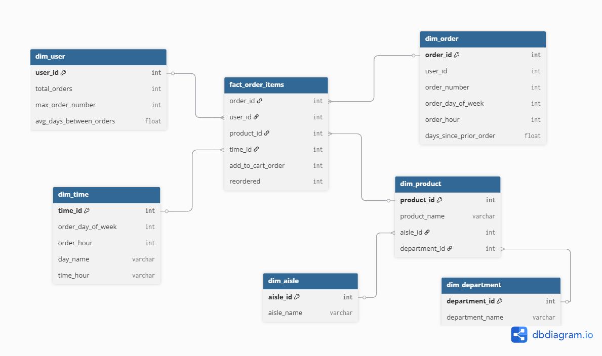
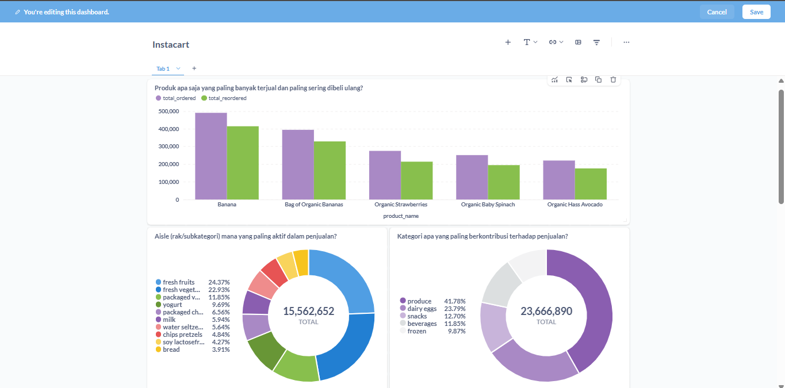

# 📦 Instacart Data Warehouse 

Proyek ini membangun **Data Warehouse** dari dataset [**Instacart**](https://www.kaggle.com/datasets/psparks/instacart-market-basket-analysis) menggunakan **dbt (Data Build Tool)** dan **PostgreSQL**. Proyek mencakup proses **ETL/ELT** lengkap: mulai dari pemuatan data mentah, pembersihan, transformasi, pembuatan tabel dimensi & fakta (star schema), hingga testing dan dokumentasi otomatis.


## 🧱 Teknologi & Tools

- **dbt (data build tool)** untuk transformasi data
- **PostgreSQL** sebagai data warehouse
- **Metabase** untuk visualisasi
- **GitHub** untuk version control & kolaborasi
- **dbdiagram.io** untuk ERD


## 📂 Struktur Proyek

```
instacart_dataWarehouse/
├── data/                 # File .csv mentah
├── models/
│   ├── staging/          # Model staging (stg_*)
│   ├── marts/
│   │   ├── dim/          # Model dimensi
│   │   └── fact/         # Model fakta
│   └── schema.yml        # Dokumentasi model
├── snapshots/            # (Opsional jika dibutuhkan)
├── dbt_project.yml       # Konfigurasi proyek dbt
├── README.md             # Dokumentasi ini
```


## 📈 Tujuan Proyek

Membangun sistem data warehouse yang:
- Menyediakan **struktur data analitik** yang bersih, tervalidasi, dan mudah digunakan
- Memungkinkan pembuatan laporan seperti:
  - Penjualan per produk & kategori
  - Pola belanja pelanggan
  - Waktu populer untuk belanja
  - Produk paling sering dibeli ulang


---
## 🧭 Roadmap Tahapan Proyek

| Tahap | Nama Tahap                      | Tujuan                                                                 |
|-------|----------------------------------|------------------------------------------------------------------------|
| 1     | **Analisis & Perancangan**      | Memahami struktur data & merancang **star schema**                    |
| 2     | **Load Raw Data**               | Memuat data CSV ke PostgreSQL atau menggunakan `dbt seed`             |
| 3     | **Staging Layer**               | Membersihkan, menstandarisasi, dan memvalidasi data mentah            |
| 4     | **Intermediate Layer** (Opsional) | Transformasi tambahan sebelum masuk ke mart                         |
| 5     | **Dimensi dan Fakta (Mart)**    | Membangun tabel **dimensi dan fakta** (berbasis star schema)          |
| 6     | **Testing & Dokumentasi**       | Menambahkan test di `schema.yml` dan dokumentasi dengan `dbt docs`    |
| 7     | **Deployment & Automasi** (Opsional) | Deploy lokal, atau automasi via scheduler/db
---

## 🧭 Tahapan Proyek

### Tahap 1: Analisis & Perancangan
- Memahami struktur data mentah Instacart
- Mengidentifikasi kebutuhan pelaporan (penjualan produk, kategori, perilaku pelanggan)
- Merancang **star schema** dan High Level diagram
- Menyusun [rencana transformasi](docs/transformation_plan.md)

### Tahap 2: Load Data Mentah
- `dbt seed` untuk file kecil (aisles, departments, products)
- `psql` untuk file besar (order_products.csv, orders)

### Tahap 3: Staging Layer (stg_*)
- Membersihkan dan menstandarkan data
  - Rename kolom, trim/lowercase, casting
  - Handling data duplicate
  - Handling 'missing' dan NULL
  - Validasi kualitas data dan validasi foreign key


### 4. Mart Layer – Dimensi
- `dim_user`: Agregasi total orders, rata-rata jeda order
- `dim_product`: Join dengan aisle & department
- `dim_order`: Detail order (
- `dim_time`: Mapping jam dan hari (snowflake dari order)
- `dim_aisle` dan `dim_department` dimensi dari product


### 5. Mart Layer – Fakta
- `fact_order_items`: satu baris per produk dalam satu order
- Join ke semua dimensi : user, product, order, time

### 6. Testing & Dokumentasi
- Test: not_null, unique, relationships, accepted_values
- Dokumentasi `schema.yml` dan `README.md`
- Diagram star schema dll

### 7. Deployment (opsional)
- Upload ke GitHub
- Siap integrasi ke Metabase atau dbt Cloud

---

## 📊 Star Schema



Fakta utama:
- `fact_order_items` (1 baris per produk dalam 1 order)

Dimensi:
- `dim_user`
- `dim_product` (snowflake ke `dim_aisle` dan `dim_department`)
- `dim_order`
- `dim_time`

---

## 📊 Contoh Hasil Laporan Analitik



1. Produk paling sering dibeli ulang
2. Rata-rata hari antar order per user
3. Penjualan per kategori (department/aisle)
4. Distribusi waktu pembelian

---

## 🚀 Cara Menjalankan

```bash
conda activate dbtetl

# Jalankan transformasi
dbt build

# Generate dokumentasi
dbt docs generate
dbt docs serve
```

---

## 📚 Referensi

- [Instacart Kaggle Dataset](https://www.kaggle.com/datasets/psparks/instacart-market-basket-analysis)
- [dbt Documentation](https://docs.getdbt.com/)
- [PostgreSQL Docs](https://www.postgresql.org/docs/)
- [dbdiagram.io](https://dbdiagram.io)
